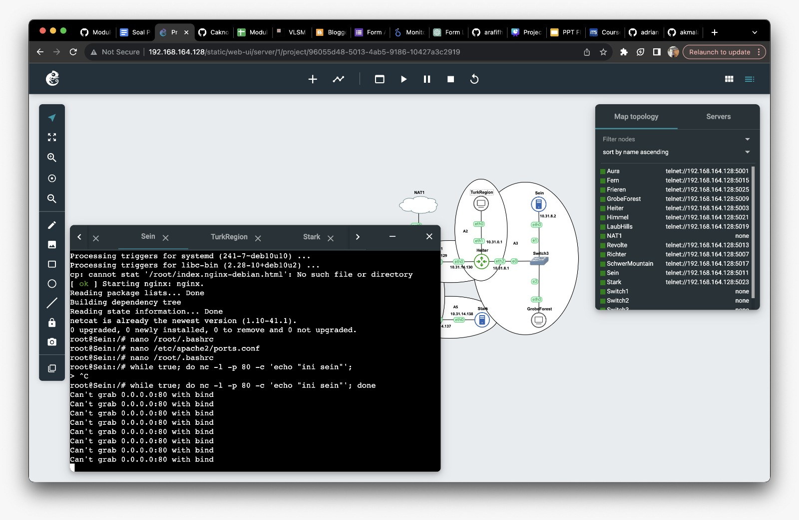
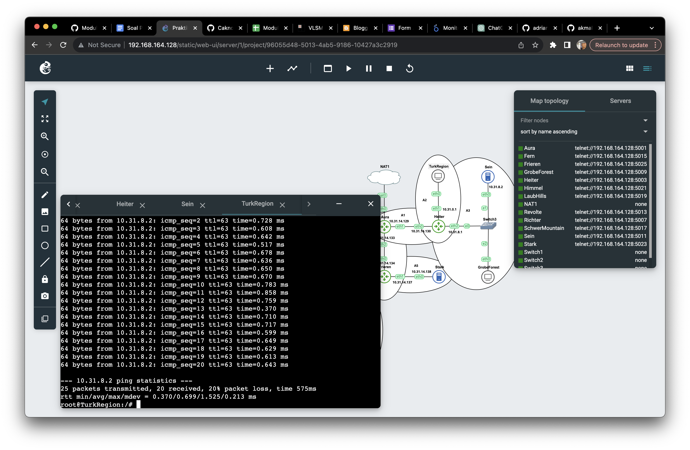
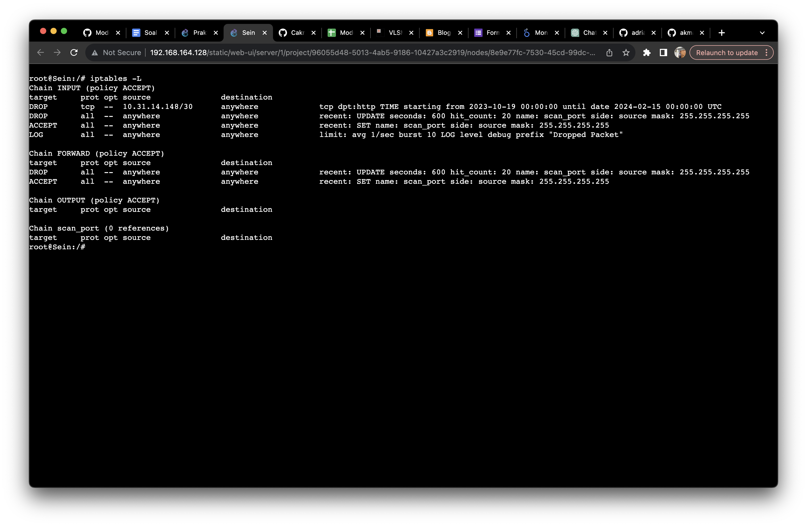

# Jarkom-Modul-5-D19-2023

Anggota:
| Nama | NRP |
|---------------------------|------------|
|Adrian Ismu Arifianto | 5025211116 |
|Ahmad Rafif Hikmatiar | 5025211247 |

## Persiapan

### Topologi


### Rute

| Subnet | Rute                                           | Jumlah IP | Netmask |
| ------ | ---------------------------------------------- | --------- | ------- |
| A1     | Aura-Heiter                                    | 2         | /30     |
| A2     | Heiter-TurkRegion                               | 1023      | /21     |
| A3     | Heiter-Switch3-Sein-Switch3-GrobeForest         | 514       | /22     |
| A4     | Aura-Frieren                                   | 2         | /30     |
| A5     | Frieren-Stark                                  | 2         | /30     |
| A6     | Frieren-Himmel                                 | 2         | /30     |
| A7     | Himmel-LaubHills                               | 256       | /23     |
| A8     | Himmel-Switch1-SchwerMountain-Switch1-Fern      | 66        | /25     |
| A9     | Fern-Richter                                   | 2         | /30     |
| A10    | Fern-Switch2-Revolte                            | 2         | /30     |
| Total  |                                                | 1871      | /20     |

### Tree


### Pembagian IP

Berikut adalah pembagian IP yang telah kami dapatkan.

| Subnet | Network ID    | Broadcast      | Mask | Dec Mask       |
| ------ | ------------- | -------------- | ---- | -------------- |
| A1     | 10.31.14.128  | 10.31.14.131   | /30  | 255.255.255.252 |
| A2     | 10.31.0.0     | 10.31.7.255    | /21  | 255.255.248.0   |
| A3     | 10.31.8.0     | 10.31.11.255   | /22  | 255.255.252.0   |
| A4     | 10.31.14.132  | 10.31.14.135   | /30  | 255.255.255.252 |
| A5     | 10.31.14.136  | 10.31.14.139   | /30  | 255.255.255.252 |
| A6     | 10.31.14.140  | 10.31.14.143   | /30  | 255.255.255.252 |
| A7     | 10.31.12.0    | 10.31.13.255   | /23  | 255.255.254.0   |
| A8     | 10.31.14.0    | 10.31.14.127   | /25  | 255.255.255.128 |
| A9     | 10.31.14.144  | 10.31.14.147   | /30  | 255.255.255.252 |
| A10    | 10.31.14.148  | 10.31.14.151   | /30  | 255.255.255.252 |

dan berikut adalah IP yang didapatkan setiap node

| Subnet | Node            | IP           |
| ------ | --------------- | ------------ |
| A1     | Aura            | 10.31.14.129 |
|        | Heiter          | 10.31.14.130 |
| A2     | Heiter          | 10.31.0.1    |
|        | TurkRegion      | DHCP         |
| A3     | Heiter          | 10.31.8.1    |
|        | Sein            | 10.31.8.2    |
|        | GrobeForest     | DHCP         |
| A4     | Aura            | 10.31.14.133 |
|        | Frieren         | 10.31.14.134 |
| A5     | Frieren         | 10.31.14.137 |
|        | Stark           | 10.31.14.138 |
| A6     | Frieren         | 10.31.14.141 |
|        | Himmel          | 10.31.14.142 |
| A7     | Himmel          | 10.31.12.1   |
|        | LaubHills       | DHCP         |
| A8     | Himmel          | 10.31.14.1   |
|        | SchwerMountain  | DHCP         |
|        | Fern            | 10.31.14.2   |
| A9     | Fern            | 10.31.14.145 |
|        | Richter         | 10.31.14.146 |
| A10    | Fern            | 10.31.14.149 |
|        | Revolte         | 10.31.14.150 |


### Subnetting

Di bawah ini adalah pengelompokan subnet yang telah disesuaikan dengan alamat IP yang telah diperoleh.

#### Aura
```
auto eth0
iface eth0 inet dhcp

auto eth1
iface eth1 inet static
	address 10.31.14.129
	netmask 255.255.255.252

auto eth2
iface eth2 inet static
	address 10.31.14.133
	netmask 255.255.255.252
```

#### Heiter 
```
auto eth0
iface eth0 inet static
	address 10.31.14.130
	netmask 255.255.255.252
	gateway 10.31.14.129
	up echo nameserver 192.168.122.1 > /etc/resolv.conf

auto eth1
iface eth1 inet static
	address 10.31.0.1
	netmask 255.255.248.0

auto eth2
iface eth2 inet static
	address 10.31.8.1
	netmask 255.255.252.0
```

#### Frieren 
```
auto eth0
iface eth0 inet static
	address 10.31.14.134
	netmask 255.255.255.252
	gateway 10.31.14.133
        up echo nameserver 192.168.122.1 > /etc/resolv.conf

auto eth1
iface eth1 inet static
	address 10.31.14.137
	netmask 255.255.255.252

auto eth2
iface eth2 inet static
	address 10.31.14.141
	netmask 255.255.255.252
```

#### Himmel 

```
auto eth0
iface eth0 inet static
	address 10.31.14.142
	netmask 255.255.255.252
	gateway 10.31.14.141
        up echo nameserver 192.168.122.1 > /etc/resolv.conf

auto eth1
iface eth1 inet static
	address 10.31.12.1
	netmask 255.255.254.0

auto eth2
iface eth2 inet static
	address 10.31.14.1
	netmask 255.255.255.128
```

#### Fern 
```
auto eth0
iface eth0 inet static
	address 10.31.14.2
	netmask 255.255.255.128
	gateway 10.31.14.1
        up echo nameserver 192.168.122.1 > /etc/resolv.conf

auto eth1
iface eth1 inet static
	address 10.31.14.145
	netmask 255.255.255.252

auto eth2
iface eth2 inet static
	address 10.31.14.149
	netmask 255.255.255.252
```

#### Revolte
```
auto eth0
iface eth0 inet static
	address 10.31.14.150
	netmask 255.255.255.252
	gateway 10.31.14.149
        up echo nameserver 192.168.122.1 > /etc/resolv.conf
```

#### Richter
```
auto eth0
iface eth0 inet static
	address 10.31.14.146
	netmask 255.255.255.252
	gateway 10.31.14.145
        up echo nameserver 192.168.122.1 > /etc/resolv.conf
```

#### Stark
```
auto eth0
iface eth0 inet static
	address 10.31.14.138
	netmask 255.255.255.252
	gateway 10.31.14.137
	up echo nameserver 192.168.122.1 > /etc/resolv.conf
```

#### Sein 
```
auto eth0
iface eth0 inet static
	address 10.31.8.2
	netmask 255.255.252.0
	gateway 10.31.8.1
	up echo nameserver 192.168.122.1 > /etc/resolv.conf
```

#### Client 
```
auto eth0
iface eth0 inet dhcp
```

### Routing

#### Aura
```bash
route add -net 10.31.14.140 netmask 255.255.255.252 gw 10.31.14.134
route add -net 10.31.14.136 netmask 255.255.255.252 gw 10.31.14.134
route add -net 10.31.12.0   netmask 255.255.254.0 gw 10.31.14.134
route add -net 10.31.14.0   netmask 255.255.255.128 gw 10.31.14.134
route add -net 10.31.14.144 netmask 255.255.255.252 gw 10.31.14.134
route add -net 10.31.14.148 netmask 255.255.255.252 gw 10.31.14.134

route add -net 10.31.0.0 netmask 255.255.248.0 gw 10.31.14.130
route add -net 10.31.8.0 netmask 255.255.252.0 gw 10.31.14.130
```

#### Heiter 
```bash
route add -net 0.0.0.0 netmask 0.0.0.0 gw 10.31.14.129
```

#### Frieren 
```bash
route add -net 0.0.0.0 netmask 0.0.0.0 gw 10.31.14.133

route add -net 10.31.12.0   netmask 255.255.254.0 gw 10.31.14.142
route add -net 10.31.14.0   netmask 255.255.255.128 gw 10.31.14.142
route add -net 10.31.14.144 netmask 255.255.255.252 gw 10.31.14.142
route add -net 10.31.14.148 netmask 255.255.255.252 gw 10.31.14.142
```

#### Himmel 

```bash
route add -net 0.0.0.0 netmask 0.0.0.0 gw 10.31.14.141

route add -net 10.31.14.144 netmask 255.255.255.252 gw 10.31.14.2
route add -net 10.31.14.148 netmask 255.255.255.252 gw 10.31.14.2
```

#### Fern 
```bash
route add -net 0.0.0.0 netmask 0.0.0.0 gw 10.31.14.1
```
### Konfigurasi

#### DNS Server

Router Richter bertindak sebagai server DNS dan akan diatur konfigurasinya menggunakan skrip bash yang akan disediakan.
```bash
apt-get update

apt-get install bind9 -y

service bind9 restart

echo '
options {
        directory "/var/cache/bind";

        forwarders {
                192.168.122.1;
        };

        allow-query{any;};
        auth-nxdomain no;
        listen-on-v6 { any; };
}; ' > /etc/bind/named.conf.options
```

#### DHCP Server
Setelah menyelesaikan konfigurasi DNS Server, kami akan beralih ke konfigurasi yang diperlukan pada DHCP Server sebagai langkah selanjutnya.
```bash
apt-get update
apt-get install isc-dhcp-server -y

service isc-dhcp-server start

echo '
INTERFACESv4="eth0"
' > /etc/default/isc-dhcp-server

echo '
option domain-name "example.org";
option domain-name-servers ns1.example.org, ns2.example.org;

default-lease-time 600;
max-lease-time 7200;

ddns-update-style none;

subnet 10.31.14.128 netmask 255.255.255.252 {
}

subnet 10.31.14.132 netmask 255.255.255.252 {
}

subnet 10.31.14.136 netmask 255.255.255.252 {
}

subnet 10.31.14.140 netmask 255.255.255.252 {
}

subnet 10.31.14.144 netmask 255.255.255.252 {
}

subnet 10.31.14.148 netmask 255.255.255.252 {
}

subnet 10.31.14.0 netmask 255.255.255.128 {
    range 10.31.14.4 10.31.14.67;
    option routers 10.31.14.1;
    option broadcast-address 10.31.14.127;
    option domain-name-servers 10.31.14.146;
    default-lease-time 720;
    max-lease-time 5760;
}

subnet 10.31.12.0 netmask 255.255.254.0 {
    range 10.31.12.2 10.31.13.1;
    option routers 10.31.12.1;
    option broadcast-address 10.31.13.255;
    option domain-name-servers 10.31.14.146;
    default-lease-time 720;
    max-lease-time 5760;
}

subnet 10.31.0.0 netmask 255.255.248.0 {
    range 10.31.0.2 10.31.4.4;
    option routers 10.31.0.1;
    option broadcast-address 10.31.7.255;
    option domain-name-servers 10.31.14.146;
    default-lease-time 720;
    max-lease-time 5760;
}

subnet 10.31.8.0 netmask 255.255.252.0 {
    range 10.31.8.3 10.31.10.5;
    option routers 10.31.8.1;
    option broadcast-address 10.31.11.255;
    option domain-name-servers 10.31.14.146;
    default-lease-time 720;
    max-lease-time 5760;
} ' > /etc/dhcp/dhcpd.conf

service isc-dhcp-server restart
```
#### DHCP Relay

DHCP Relay diaktifkan pada router `Heiter` dan `Himmel`. Heiter berlokasi dekat dengan klien `TurkRegion` dan `GrobeForest`, sementara `Himmel` berdekatan dengan `LaubHills` dan SchwerMountain. Pengaturannya adalah sebagai berikut:
```bash
apt-get update
apt-get install isc-dhcp-relay -y

echo '
SERVERS="10.31.14.150"
INTERFACES="eth0 eth1 eth2"
OPTIONS="-m replace"
' >  /etc/default/isc-dhcp-relay

echo '
net.ipv4.ip_forward=1
' >  /etc/sysctl.conf

service isc-dhcp-relay start
```

#### Web Server
Di server web kami akan menggunakan Apache2 dan akan dikonfigurasi untuk router `Sein` dan `Stark` sesuai dengan instruksi berikut.
```bash
apt update
apt install netcat -y
apt install apache2 -y
service apache2 start

echo '# If you just change the port or add more ports here, you will likely also
# have to change the VirtualHost statement in
# /etc/apache2/sites-enabled/000-default.conf

Listen 80
Listen 443

<IfModule ssl_module>
        Listen 443
</IfModule>

<IfModule mod_gnutls.c>
        Listen 443
</IfModule>

# vim: syntax=apache ts=4 sw=4 sts=4 sr noet' > /etc/apache2/ports.conf
```

#### Client
```bash
apt update
apt install netcat -y
apt install lynx -y
```

## Soal 1
> Agar topologi yang kalian buat dapat mengakses keluar, kalian diminta untuk mengkonfigurasi Aura menggunakan iptables, tetapi tidak ingin menggunakan MASQUERADE.


Dalam situasi ini, kita memiliki `Aura` dan koneksi terhubung melalui antarmuka `eth0`. Definisi ini dapat dimasukkan ke dalam suatu variabel. Variabel yang digunakan di sini disebut sebagai `IPETH0`.

### Script
```bash
IPETH0=$(ifconfig eth0 | grep 'inet ' | awk '{print $2}' | cut -d' ' -f2 | cut -d'/' -f1)

iptables -t nat -A POSTROUTING -s 10.31.0.0/20 -o eth0 -j SNAT --to-source $IPETH0
```
### Output
#### Sebelum


#### Sesudah


## Soal 2
> Kalian diminta untuk melakukan drop semua TCP dan UDP kecuali port 8080 pada TCP.
### Script
```bash
iptables -A INPUT -p tcp --dport 8080 -j ACCEPT
iptables -A INPUT -p tcp -j DROP
iptables -A INPUT -p udp -j DROP
```

* A INPUT: Menambahkan aturan ke dalam chain INPUT (untuk lalu lintas yang menuju sistem).
* p tcp: Menentukan protokol yang digunakan, dalam hal ini TCP. --dport 8080: Menentukan port tujuan, yakni port 8080.
* j ACCEPT: Menentukan tindakan yang diambil jika paket memenuhi kriteria aturan, dalam hal ini menerima paket.
* j DROP: Menentukan tindakan yang diambil jika paket memenuhi kriteria aturan, dalam hal ini menolak (DROP) paket.

### Output
#### Sukses


#### Gagal


## Soal 3
> Kepala Suku North Area meminta kalian untuk membatasi DHCP dan DNS Server hanya dapat dilakukan ping oleh maksimal 3 device secara bersamaan, selebihnya akan di drop.

### Script
```bash
iptables -I INPUT -p icmp -m connlimit --connlimit-above 3 --connlimit-mask 0 -j DROP
iptables -I INPUT -m state --state ESTABLISHED,RELATED -j ACCEPT
```
Penjelasan ini menggambarkan langkah-langkah dari perintah yang digunakan:

* `I INPUT`: Menyisipkan aturan ke dalam awal chain INPUT.
* `p icmp`: Menetapkan protokol yang dipakai, yaitu ICMP (Internet Control Message Protocol), yang umumnya digunakan untuk ping dan pesan kontrol jaringan.
* `m connlimit`: Menggunakan modul connlimit untuk membatasi jumlah koneksi.
* `--connlimit-above 3`: Menetapkan batas atas jumlah koneksi yang diizinkan. Aturan ini berupaya membatasi jumlah koneksi ICMP di atas 3.
* `--connlimit-mask 0`: Menetapkan mask untuk mengidentifikasi koneksi. Dengan nilai 0, aturan ini akan membatasi jumlah koneksi berdasarkan alamat IP sumber.
* `--state ESTABLISHED,RELATED`: Menetapkan bahwa aturan ini diterapkan pada paket yang terkait dengan koneksi yang sudah didirikan (ESTABLISHED) atau terkait dengan koneksi yang ada (RELATED), seperti paket respon terkait permintaan koneksi.
* `m state`: Menggunakan modul state untuk mengelola status koneksi.
* `j DROP`: Menentukan tindakan yang diambil jika batasan koneksi terlampaui, yaitu menolak (DROP) paket tersebut.

### Output


Pada `GrobeForest` tidak berhasil melakukan ping karena `Richter` sudah mencapai 3 koneksi.
## Soal 4
> Lakukan pembatasan sehingga koneksi SSH pada Web Server hanya dapat dilakukan oleh masyarakat yang berada pada GrobeForest.

### Script
```bash
iptables -A INPUT -p tcp --dport 22 -s 10.31.8.0/22 -j ACCEPT
iptables -A INPUT -p tcp --dport 22 -j DROP
```
### Output
#### GrobeForest


#### LaubHills


## Soal 5
> Selain itu, akses menuju WebServer hanya diperbolehkan saat jam kerja yaitu Senin-Jumat pada pukul 08.00-16.00. Pada Sein dan Stark

### Script
```
iptables -A INPUT -m time --timestart 08:00 --timestop 16:00 --weekdays Mon,Tue,Wed,Thu,Fri -j ACCEPT
iptables -A INPUT -j REJECT
```
### Output
#### Saat Jam Kerja


#### Saat Tidak Jam Kerja


## Soal 6
Dalam soal, kita disuruh untuk menambah jam istirahat pada Web Server dengan tambahan jam makan siang.
### Script
```bash
iptables -I INPUT 3 -m time --timestart 12:00 --timestop 13:00 --weekdays Mon,Tue,Wed,Thu -j REJECT
iptables -I INPUT 4 -m time --timestart 11:00 --timestop 13:00 --weekdays Fri -j REJECT
```
### Output
.png)
.png)
dari hasil di atas, saya melakukan testing untuk output yang sukses dan output yang gagal dengan mengatur date pada node Sein

## Soal 7
Untuk soal ini, kami belom bisa menyelesaikannya. Script yang kami gunakan belum bisa menghasilkan output yang diminta dalam soal
### Script
```bash
iptables -A PREROUTING -t nat -p tcp --dport 80 -d 10.31.8.2 -m statistic --mode nth --every 2 --packet 0 -j DNAT --to-destination 10.31.8.2

iptables -A PREROUTING -t nat -p tcp --dport 80 -d 10.31.8.2 -j DNAT --to-destination 10.31.14.128

iptables -A PREROUTING -t nat -p tcp --dport 443 -d 10.31.14.128 -m statistic --mode nth --every 2 --packet 0 -j DNAT --to-destination 10.31.14.128

iptables -A PREROUTING -t nat -p tcp --dport 443 -d 10.31.14.128 -j DNAT --to-destination 10.31.8.2

while true; do nc -l -p 80 -c 'echo "ini sein"'; done dan while true; do nc -l -p 443 -c 'echo "ini stark"'; done

while true; do nc -l -p 443 -c 'echo "ini sein"'; done dan while true; do nc -l -p 443 -c 'echo "ini stark"'; done
```
### Output


## Soal 8
Dalam soal, kita harus melakukan filter kepada node Revolte untuk mengakses Web Server
### Script
```bash
Revolte_Subnet="10.31.14.148/30"

Pemilu_Start=$(date -d "2023-10-19T00:00" +"%Y-%m-%dT%H:%M")

Pemilu_End=$(date -d "2024-02-15T00:00" +"%Y-%m-%dT%H:%M")

iptables -A INPUT -p tcp -s $Revolte_Subnet --dport 80 -m time --datestart "$Pemilu_Start" --datestop "$Pemilu_End" -j DROP
```
Lalu setelah itu kita lakukan testing pada Revolte dan Client
### Output
.png)
.png)

## Soal 9
Dalam soal, kita harus melakukan DROP pada IP yang melakukan scanning port lebih dari 20 dalam waktu 10 menit
### Script
```bash
iptables -N scan_port

iptables -A INPUT -m recent --name scan_port --update --seconds 600 --hitcount 20 -j DROP

iptables -A FORWARD -m recent --name scan_port --update --seconds 600 --hitcount 20 -j DROP

iptables -A INPUT -m recent --name scan_port --set -j ACCEPT

iptables -A FORWARD -m recent --name scan_port --set -j ACCEPT
```
Lalu kita bisa melakukan testing dengan cara ping Sein sebanyak 25 kali
### Output

bisa kita lihat setelah ping ke 20 maka akan otomatis stop

## Soal 10
Dalam soal, kita harus membuat log untuk menampilkan paket apa saja yang didrop
### Script
```bash
iptables -A INPUT  -j LOG --log-level debug --log-prefix 'Dropped Packet' -m limit --limit 1/second --limit-burst 10
```
Lalu gunakan command iptables -L
### Output
